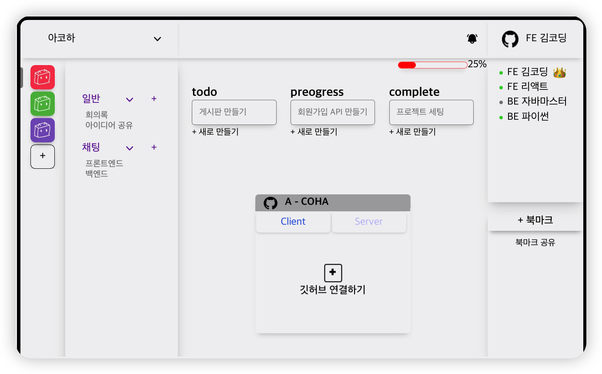

<a name="readme-top"></a>


[![Contributors][contributors-shield]][contributors-url]
[![Forks][forks-shield]][forks-url]
[![Stargazers][stars-shield]][stars-url]
[![Issues][issues-shield]][issues-url]


<!-- PROJECT LOGO -->
<br />
<div align="center">
  <a href="https://github.com/a-co-ha/server">
    
  </a>

<h3 align="center">A-COHA</h3>

  <p align="center">
    아 코딩하고 싶다! 
    <br />
    <a href="https://documenter.getpostman.com/view/25838963/2s93CPpBte"><strong>Explore API docs »</strong></a>
    <br />
    <br />
    <a href="https://acoha.site">View Demo</a>·
    <a href="https://github.com/a-co-ha/server/issues">Report Bug</a>
  </p>
</div>


<!-- TABLE OF CONTENTS -->
<details>
  <summary>Table of Contents</summary>
  <ol>
    <li>
      <a href="#about-the-A-COHA">About The A-COHA</a>
      <ul>
        <li><a href="#built-with">Built With</a></li>
      </ul>
    </li>
    <li>
      <a href="#getting-started">Getting Started</a>
      <ul>
        <li><a href="#prerequisites">Prerequisites</a></li>
        <li><a href="#installation">Installation</a></li>
      </ul>
    </li> 
    <li><a href="#contact">Contact</a></li>
  </ol>
</details>


<!-- ABOUT THE PROJECT -->
## About The A-COHA
 
  The project we are currently developing is an integrated management platform that allows users to have a clear overview of the project's progress.

This platform provides a functionality similar to Notion, where users can easily create and share posts.

Additionally, it offers a chat feature similar to Discord, enabling real-time communication among team members.

Moreover, it provides an effective way to track the project's progress by integrating GitHub's commit logs and project milestones.

With these features, team members can quickly grasp the project's status and collaborate more efficiently.

Our platform aims to enhance project management by adding an extra layer of efficiency.
<details>


<summary>한국어</summary>
저희가 개발 중인 프로젝트는 현재 진행 상황을 한눈에 볼 수 있는 통합 관리 플랫폼입니다.

이 플랫폼은 노션과 같이 간편하게 게시글을 작성하고 공유할 수 있는 기능을 제공합니다. 

또한, 디스코드와 유사한 채팅 기능을 통해 실시간으로 소통할 수 있습니다.

그리고 GitHub의 커밋 로그와 프로젝트 진행률을 효과적으로 확인할 수 있는 기능도 제공합니다.
  
이를 통해 팀원들은 프로젝트의 진행 상황을 신속하게 파악하고 협업을 원활히 진행할 수 있습니다. 
  
우리 플랫폼은 프로젝트 관리를 한 단계 더 효율적으로 만들어줄 것입니다.

</details>
<p align="right">(<a href="#readme-top">back to top</a>)</p>


### Built With

* [![Express][Express.js]][Express-url]
* [![Socket][Socket.js]][Socket-url]
* [![redis][redis.io]][redis-url]
* [![mongoDB][mongoDB.dev]][mongoDB-url]
* [![mysql][mysql.com]][mysql-url]

<p align="right">(<a href="#readme-top">back to top</a>)</p>


<!-- GETTING STARTED -->
## Getting Started

This is an example of how you may give instructions on setting up your project locally.
To get a local copy up and running follow these simple example steps.

### Prerequisites

This is an example of how to list things you need to use the software and how to install them.
* npm
  ```sh
  npm install npm@latest -g
  ```
* yarn 
    ```sh
  npm install --global yarn
    ```


### Installation

1. Get a free github Client ID, Client secrets Key at [https://github.com/settings/developers](https://github.com/settings/developers)
2. Get a free github Personal access tokens  at [https://github.com/settings/tokens](https://github.com/settings/tokens)
3. Clone the repo
   ```sh
   git clone https://github.com/a-co-ha/server.git
   cd server
   ```
4. create .env
   ```js
    cat .env.dev

    PORT=3001
    DB_NAME=<YOUR MYSQL>
    MYSQL_USER=<YOUR MYSQL>
    MYSQL_PASSWORD=<YOUR MYSQL_PASSWORD>
    MYSQL_DATABASE=<YOUR MYSQL_DATABASE>
    MYSQL_PORT=<YOUR MYSQL_PORT>
    GITHUB_OAUTH_CLIENT_ID=<YOUR github Client ID>
    GITHUB_OAUTH_CLIENT_SECRET=<YOUR Client secrets Key>
    REDIS_HOST=<YOUR REDIS_HOST>
    REDIS_PORT=<YOUR REDIS_PORT>
    REDIS_USERNAME=<YOUR REDIS_USERNAME>
    REDIS_PASSWORD=<YOUR REDIS_PASSWORD>
    GITHUBAUTH=ghp_<YOUR GITHUBAUTH>
    GITHUBACCESSURL=https://github.com/login/oauth/access_token
    GITHUBUSERURL=https://api.github.com/user
   ```
5. docker build 
    ```sh
    docker-compose -f docker-compose-dev.yml up -d --build 
     ```

    There may be additional environment variables required.
<p align="right">(<a href="#readme-top">back to top</a>)</p>


## Contact

- Seungha Oh  : https://github.com/AhGnuesHo

- suho Yi : https://github.com/yisuho


<p align="right">(<a href="#readme-top">back to top</a>)</p>


<!-- MARKDOWN LINKS & IMAGES -->
<!-- https://www.markdownguide.org/basic-syntax/#reference-style-links -->
[contributors-shield]: https://img.shields.io/github/contributors/a-co-ha/server.svg?style=for-the-badge
[contributors-url]: https://github.com/a-co-ha/server/graphs/contributors
[forks-shield]: https://img.shields.io/github/forks/a-co-ha/server.svg?style=for-the-badge
[forks-url]: https://github.com/a-co-ha/server/network/members
[stars-shield]: https://img.shields.io/github/stars/a-co-ha/server.svg?style=for-the-badge
[stars-url]: https://github.com/a-co-ha/server/stargazers
[issues-shield]: https://img.shields.io/github/issues/a-co-ha/server.svg?style=for-the-badge
[issues-url]: https://github.com/a-co-ha/server/issues

[Express.js]: https://img.shields.io/badge/Express-20232A?style=for-the-badge&logo=express&logoColor=61DAFB
[Express-url]: https://expressjs.com/ko/


[Socket.js]: https://img.shields.io/badge/Socket.io-35495E?style=for-the-badge&logo=socket.io&logoColor=4FC08D
[Socket-url]: https://socket.io/


[redis.io]: https://img.shields.io/badge/redis-DD0031?style=for-the-badge&logo=redis&logoColor=white
[redis-url]: https://redis.com/


[mongoDB.dev]: https://img.shields.io/badge/mongoDB-4A4A55?style=for-the-badge&logo=mongoDB&logoColor=FF3E00
[mongoDB-url]: https://www.mongodb.com/


[mysql.com]: https://img.shields.io/badge/mysql-FF2D20?style=for-the-badge&logo=mysql&logoColor=white
[mysql-url]: https://mysql.com
